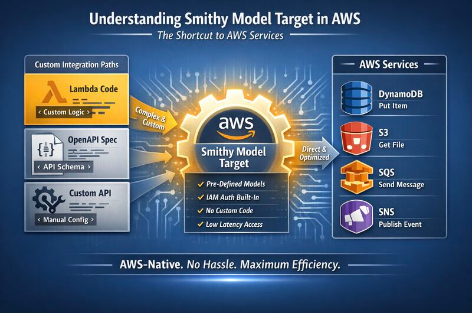

# smithy-playground
The process begins when you run smithy build (via the CLI) or trigger a Gradle build. The CLI entry point is:
```java
@Override
public String getSummary() {
    return "Builds Smithy models and creates plugin artifacts for each projection found in smithy-build.json.";
}
```
This command reads `smithy-build.json`, loads the model, and delegates to `SmithyBuild`.

##  Configuration: smithy-build.json

The build is configured via `smithy-build.json`, which defines projections (model views/filters) and plugins (code generators). Example structure:
```json
{
  "projections": {
    "myProjection": {
      "transforms": [
        "source:my-model.smithy",
        "filter:include[shapeType=structure]"
      ]
    }
  },
  "plugins": {
    "myPlugin": {
      "type": "codegen",
      "projection": "myProjection",
      "settings": {
        // plugin-specific settings
      }
    }
  }
}
```
```json
{
  "version": "1.0",
  "projections": {
    "codegen-projection": {
      "plugins": {
        "mylang-client-codegen": {
          "service": "com.example#MyService"
        }
      }
    }
  }
}
```
Each projection can have transforms (to filter/modify the model) and plugins (to generate artifacts). The `type` field in plugins indicates the plugin type (e.g., codegen, validation).

## Model Assembly: Model.assembler()
Smithy `.smithy` or `.json` model files are parsed and assembled into an in-memory `Model` object:
```java
Model model = Model.assembler()
    .addImport("src/main/smithy/model.smithy")
    .assemble()
    .unwrap();

Model model = Model.assembler()
    .addImport(Paths.get("model/main.smithy"))
    .discoverModels(classLoader)
    .assemble()
    .unwrap();    
```
The `ModelAssembler` handles parsing, validation, and constructing the complete shape graph.

## Build Orchestration: SmithyBuild → SmithyBuildImpl
`SmithyBuild.build()` creates a `SmithyBuildImpl` which orchestrates the pipeline:
```java
SmithyBuildImpl buildImpl = new SmithyBuildImpl(model, projections, plugins);
buildImpl.execute();
```
```java
/**
     * Builds the model and applies all projections, passing each
     * {@link ProjectionResult} to the provided callback as they are
     * completed and each encountered exception to the provided
     * {@code exceptionCallback} as they are encountered.
     *
     * <p>This method differs from {@link #build()} in that it does not
     * require every projection and projection result to be loaded into
     * memory.
     *
     * <p>The result each projection is placed in the outputDirectory.
     * A {@code [projection]-build-info.json} file is created in the output
     * directory. A directory is created for each projection using the
     * projection name, and a file named model.json is place in each directory.
     *
     * @param resultCallback A thread-safe callback that receives projection
     *   results as they complete.
     * @param exceptionCallback A thread-safe callback that receives the name
     *   of each failed projection and the exception that occurred.
     * @throws IllegalStateException if a {@link SmithyBuildConfig} is not set.
     */
    public void build(Consumer<ProjectionResult> resultCallback, BiConsumer<String, Throwable> exceptionCallback) {
        new SmithyBuildImpl(this).applyAllProjections(resultCallback, exceptionCallback);
    }
```
For each projection in the config, `SmithyBuildImpl`:
- Applies transforms (e.g., includeShapesByTag, excludeShapesByTrait) to produce a projected model
- Resolves plugins by name using Java SPI (ServiceLoader)
- Executes each plugin, passing a `PluginContext` containing the projected model and a `FileManifest`

## Plugin System: SmithyBuildPlugin (SPI-based discovery)

Every code generator must implement `SmithyBuildPlugin`:
```java
public interface SmithyBuildPlugin {
    String getName();
    void execute(PluginContext context);
}
```
Plugins are discovered via Java SPI using `META-INF/services/software.amazon.smithy.build.SmithyBuildPlugin` files on the classpath. The `pluginFactory` looks up plugins by the name specified in `smithy-build.json`.



