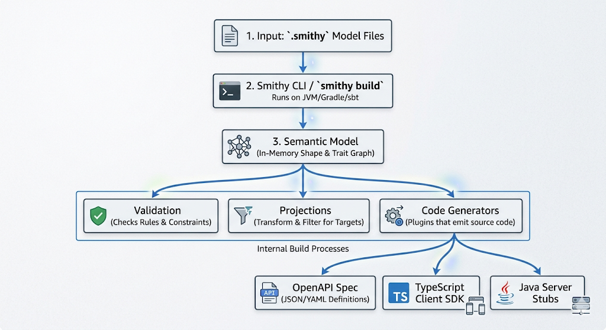

# Codegen
The Smithy Java `codegen` plugin reads this model. It doesn't just create "templates"; it builds a complete, type-safe Java library including:
- `Data Classes`: Java POJOs for every input/output.
- `Serializers`: Code that converts those POJOs to JSON, XML, or CBOR.
- `HTTP Logic`: The actual code to open a connection, set headers, handle timeouts, and manage retries.

The framework is intentionally split into these modules so that your final application only includes the code it actually needs. If you're building a client, you don't pull in server code; if you aren't using Netty, you don't pull in Netty.

A plugin like `java-codegen` looks at your `.smithy` file and generates `.java` files. The Plugin is the "translator" or "compiler" that converts the abstract Smithy model into concrete code.

A Client Generator produces code specifically for the consumer of an API and depends on `client-core`and `client-http`.
Key Features generated:
- `Fluent Builders`: `CoffeeClient.builder().build()`.
- `Resilience`: Automatic retries, timeouts, and error handling.
- `Abstraction`: It hides the HTTP details. You call a method; it handles the headers and JSON.

A Server Generator produces "stubs" or "skeletons" for the provider of the API and depends on `server-core` and `server-netty`.

Key Features generated:
- `Interfaces`: You get a Java Interface (e.g., interface CoffeeShop) that you must implement with your business logic.
- `Routing`: It generates the code that maps an incoming `POST /coffee` request to your `makeCoffee()` method.
- `Validation`: It automatically rejects requests that don't match the model (e.g., missing a required "price" field).

When the plugin generates your client, it adds several layers of "intelligent" code that you would otherwise have to write manually:
- `Retry Logic`: It doesn't just try once and fail. It includes an Exponential Backoff strategy. If the server is busy (HTTP 429 or 503), the client knows to wait 100ms, then 200ms, then 400ms before giving up.
- `Authentication (The Handshake)`: If your model has` @httpApiKeyAuth` or `@sigv4,` the client generates the code to sign every request. It handles the complex math of headers, timestamps, and secret keys automatically.
- `Validation (Client-Side)`: It checks your data before sending it. If a field is marked @required in Smithy and you leave it null in Java/Scala, the client throws an exception immediately, saving you a round-trip to the server.
- `Serialization Logic`: It handles the "boring" translation of your objects into bytes (`JSON`, `XML`, or the fast `RPCv2-CBOR` binary format) and ensures the Content-Type headers are perfect.
- `Endpoint Resolution`: It can handle complex logic for where to send requests (e.g., "if region is 'us-east-1', send to this URL; otherwise, send to that one").

Smithy-Translate (Bridge to OpenAPI/JSON Schema)converts the Smithy JSON AST into OpenAPI 3.0/3.1 or raw JSON Schema.

## The Build Process
- `Discovery`: It finds all `.smithy` files in your project.
- `Assembly`: It "merges" all files into a single in-memory model (the AST).
- `Validation`: It runs semantic checks (e.g., "Are you missing a required field?" or "Does this @http trait have a valid path?").
- `Projection`: It creates a "view" of the model (e.g., stripping out internal comments or AWS-specific tags).
- `Plugins`: It executes JAR-based plugins (like `java-codegen` or `openapi`) by passing the model AST to them.

Why they are separate: You might use multiple plugins on one model—one to generate a Java client, one to generate a TypeScript client, and one to generate OpenAPI documentation. 

### Dynamic Client (The "No-Generator" Path)
Smithy Java and Smithy4s both have a Dynamic module. This is used when you don't want to (or can't) run a generator during build time

### The "Modes" of the Generator
When you configure the plugin, you tell it which "hat" to wear using the modes field:
```json
// smithy-build.json
"plugins": {
    "java-codegen": {
        "service": "com.unitypay#Gateway",
        "modes": ["client", "server"] 
    }
}
```


```json
{
  "version": "1.0",
  "sources": ["src/"],
  "plugins": {
    "openapi": {
      "service": "<%- namespace %>#<%- serviceNameClassName %>",
      "version": "3.1.0",
      "tags": true,
      "useIntegerType": true
    },
    "typescript-ssdk-codegen": {
      "package" : "@<%- scope %>/<%- serviceNameKebabCase %>-ssdk",
      "packageVersion": "0.0.1"
    }
  },
  "maven": {
    "dependencies": [
      "software.amazon.smithy:smithy-model:1.61.0",
      "software.amazon.smithy:smithy-aws-traits:1.61.0",
      "software.amazon.smithy:smithy-validation-model:1.61.0",
      "software.amazon.smithy:smithy-openapi:1.61.0",
      "software.amazon.smithy.typescript:smithy-aws-typescript-codegen:0.34.1"
    ]
  }
}
```
```json
{
  "version": "1.0",
  "sources": ["model"],
  "plugins": {
    "java-codegen": {
      "service": "smithy.mcp.toolassistant#ToolAssistant",
      "namespace": "software.amazon.smithy.java.mcp",
      "headerFile": "license.txt",
      "runtimeTraits": ["smithy.api#documentation", "smithy.api#examples", "smithy.ai#prompts", "smithy.mcp#oneOf" ],
      "modes": ["server", "types"]
    },
    "trait-codegen": {
      "package": "software.amazon.smithy.java.mcp",
      "namespace": "smithy.mcp",
      "header": ["license.txt"]
    }
  }
}
```
```json
{
  "version": "1.0",
  "plugins": {
    "java-codegen": {
      "service": "smithy.example#BeerService",
      "namespace": "software.amazon.smithy.java.example.lambda",
      "modes": ["server"]
    }
  }
}
```
```json
{
  "version": "1.0",
  "plugins": {
    "java-codegen": {
      "namespace": "software.amazon.smithy.java.json.bench",
      "modes": ["types"]
    }
  }
}
```
```json
{
  "version": "1.0",
  "plugins": {
    "java-codegen": {
      "service": "com.example#CoffeeShop",
      "namespace": "software.amazon.smithy.java.example.etoe",
      "headerFile": "license.txt",
      "protocol": "aws.protocols#restJson1",
      "modes": ["client", "server"]
    }
  }
}
```


### Code Generation
- Code generation happens during the `smithyBuild` task
- Generated code is placed in `build/smithy/` directories
- Use `smithy-build.json` files to configure code generation

### Core Framework Structure
This is a **Smithy Interface Definition Language (IDL)** implementation for Java with a layered architecture:

1. **Schema System** (`core/`) - Runtime representation of Smithy models with precompiled validation
2. **Code Generation** (`codegen/`) - Transforms Smithy models into Java client/server code  
3. **Protocol Layer** - Pluggable protocol implementations (REST JSON, RPC CBOR, AWS protocols)
4. **Transport Layer** - HTTP and other transport implementations
5. **Runtime Components** - Client/server frameworks that generated code depends on

### Key Architectural Patterns

**Plugin Architecture**: Uses Java ServiceLoader extensively for protocol, transport, and codec discovery via `META-INF/services/` files.

**Schema-Driven Runtime**: Smithy models compile to runtime `Schema` objects with precomputed validations for performance.

**Async-First Design**: All client operations return `CompletableFuture<T>`, servers use job-based orchestration.

**Layered Protocol Architecture**:
```
Generated Client/Server Code
       ↓
Protocol Layer (REST JSON, RPC CBOR, etc.)
       ↓  
Transport Layer (HTTP, etc.)
       ↓
Codec Layer (JSON, CBOR, XML)
```

### Module Organization

**Core Modules**:
- `core/` - Schema system, serialization, validation
- `codegen/` - Code generation framework and plugins
- `client/` - Client runtime framework with protocol/transport abstraction
- `server/` - Server framework with orchestrator pattern and handler architecture

**Protocol Implementations**:
- `client-rpcv2-cbor/` - Binary RPC protocol using CBOR serialization
- `aws/client/` - AWS protocol implementations (REST JSON, REST XML, AWS JSON)
- `codecs/` - Protocol-agnostic serialization (JSON, CBOR, XML)

**AWS Integration**:
- `aws/` - AWS-specific protocols, SigV4 auth, SDK v2 compatibility
- Service bundling tools for packaging AWS service models

**MCP Integration**:
- `mcp/` - Model Context Protocol server implementation
- Supports both direct handler and proxy modes

### Code Generation Flow

1. **Input**: Smithy model files (`.smithy`) and `smithy-build.json` configuration
2. **Processing**: CodeGenerationContext coordinates JavaSymbolProvider and specialized generators
3. **Output**: Generated Java classes in `build/smithy/` with runtime dependencies on core modules
4. **Integration**: JavaCodegenIntegration plugins extend generation process

### Important Implementation Notes

**Service Discovery**: New protocol/transport implementations must register via ServiceLoader in `META-INF/services/` files.

**Schema Performance**: The schema system precomputes validation constraints - avoid runtime constraint compilation.

**Generated Code Integration**: Generated clients/servers depend on corresponding runtime modules (`client-core`, `server-core`).

**Protocol Implementation**: Client and server protocol implementations are separate - both sides must be implemented for full protocol support.

```kts
dependencies {
    // 1. The WORKER (The Generator JAR)
    // This JAR stays at the factory.
    smithyBuild("software.amazon.smithy.java:codegen-plugin:1.0.0")

    // 2. The PARTS (The Runtime JARs)
    // These JARs travel with your app to production.
    implementation("software.amazon.smithy.java:client-core:1.0.0")
    implementation("software.amazon.smithy.java:client-http:1.0.0")
    
    // 3. Protocol JARs (Optional)
    // Add only the one your service uses (e.g., JSON or CBOR)
    implementation("software.amazon.smithy.java:client-rpcv2-cbor:1.0.0")
}
```


```json
{
    "version": "1.0",
    "plugins": {
        "java-codegen": {
            "service": "com.unitypay#Gateway",
            "package": "com.unitypay.client",
            "modes": ["client"]
        }
    }
}
```
Smithy allows you to have multiple services in one project (e.g., a `BillingService` and a `UserRegistrationService` sharing the same data types).

```json
{
    "version": "1.0",
    "projections": {
        "billing": {
            "plugins": {
                "java-codegen": {
                    "service": "com.unitypay#BillingService",
                    "package": "com.unitypay.billing",
                    "modes": ["client", "server"]
                }
            }
        },
        "registration": {
            "plugins": {
                "java-codegen": {
                    "service": "com.unitypay#UserRegistrationService",
                    "package": "com.unitypay.registration",
                    "modes": ["client", "server"]
                }
            }
        }
    }
}
```
Smithy Java allows for Service-Independent Generation. You can use a "types-only" mode that doesn't strictly require a service "root" to generate your data shapes.

## Framework/Runtime and the Generator (Codegen)
One of the most powerful parts of Smithy is Model-to-Code validation.
### The Generators (The "Builders")
The Generator is a plugin that transforms Smithy models into Java code. The Framework/Runtime is the library that generated code depends on to function.

Repositories like `smithy-go`, `smithy-java`, or `smithy-kotlin` contain the logic required to turn a Smithy model (a .smithy file) into source code.
- They are essentially plugins or modules that the Smithy CLI or Gradle uses.  
- When you run a build command, these generators look at your API shapes, traits, and protocols, and then "print" the Go or Java files that make up your client or server.
- It writes the code that knows exactly how to turn a Java object into a specific wire format (like JSON, XML, or even CBOR).
### The Runtime/Framework (The "Support")
The Runtime/Framework is the library that generated code depends on to function. It includes:
- `client-core` and `client-http` for clients
- `server-core` and `server-netty` for servers
- Protocol implementations (e.g., `client-rpcv2-cbor` for the RPC CBOR protocol)
- AWS-specific modules for AWS protocols and SigV4 signing
- It provides the underlying logic for making HTTP calls, handling retries, signing requests, and more. The generated code is essentially "glue" that connects your API definition to the capabilities of the runtime.

## AWS Protocols
- AWS restJson1 protocol
- AWS JSON 1.0 protocol
- AWS JSON 1.1 protocol
- AWS restXml protocol
- AWS query protocol
- AWS EC2 query protocol

[aws json](https://github.com/smithy-lang/smithy-java/tree/main/aws/client/aws-client-awsjson)
[aws query](https://github.com/smithy-lang/smithy-java/tree/main/aws/client/aws-client-awsquery)
[aws core](https://github.com/smithy-lang/smithy-java/tree/main/aws/client/aws-client-core)
[aws http](https://github.com/smithy-lang/smithy-java/tree/main/aws/client/aws-client-http)
[aws restjson](https://github.com/smithy-lang/smithy-java/tree/main/aws/client/aws-client-restjson)
[aws restxml](https://github.com/smithy-lang/smithy-java/tree/main/aws/client/aws-client-restxml)



```
┌──────────────────────────────────────────────────────┐
│            SmithyBuildPlugin (entry point)           │
│                                                      │
│  execute(PluginContext ctx)                          │
│    │                                                 │
│    ├── 1. Extract settings from ctx.getSettings()    │
│    ├── 2. Get model from ctx.getModel()              │
│    ├── 3. Build CodegenContext (your custom state)   │
│    └── 4. Run DirectedCodegen pipeline               │
│                                                      │
└──────────────────────────────────────────────────────┘
          │
          ▼
┌──────────────────────────────────────────────────────┐
│          DirectedCodegen (orchestrator)              │
│                                                      │
│  Walks the model systematically:                     │
│                                                      │
│  1. generateService(ServiceShape)                    │
│     → emit: service client class, configuration       │
│                                                      │
│  2. for each operation:                              │
│     generateOperation(OperationShape)                │
│     → emit: request/response types, handler method   │
│                                                      │
│  3. for each structure (in closure):                 │
│     generateStructure(StructureShape)                │
│     → emit: data class/record                        │
│                                                      │
│  4. for each union:                                  │
│     generateUnion(UnionShape)                        │
│     → emit: discriminated union / sealed class       │
│                                                      │
│  5. for each enum:                                   │
│     generateEnum(StringShape + @enum)                │
│     → emit: enum type                                │
│                                                      │
│  6. for each error:                                  │
│     generateError(StructureShape + @error)           │
│     → emit: error/exception class                    │
│                                                      │
│  7. customizeBeforeIntegrations()                    │
│  8. runIntegrations() ← auth, endpoint, retry logic  │
│  9. customizeAfterIntegrations()                     │
│                                                      │
└──────────────────────────────────────────────────────┘
          │
          ▼
┌──────────────────────────────────────────────────────┐
│          SymbolProvider (name mapping)               │
│                                                      │
│  Translates Smithy names → target language names:    │
│                                                      │
│  toMemberName("client_namespace") → "clientNamespace"│
│  toSymbol(ShapeId) → Symbol {                        │
│      name: "ClientNamespace",                        │
│      namespace: "unison.identitymanagement",   │
│      definitionFile: "models/ClientNamespace.cs"      │
│  }                                                   │
│                                                      │
│  Each language codegen has its own SymbolProvider    │
│  that handles naming conventions:                    │
│    TypeScript: camelCase members, PascalCase types   │
│    Python: snake_case members, PascalCase types      │
│    Go: exported PascalCase, unexported camelCase     │
│    C#: PascalCase everything, _ prefix for fields      │
│                                                      │
└──────────────────────────────────────────────────────┘
          │
          ▼
┌──────────────────────────────────────────────────────┐
│          CodeWriter (templating engine)              │
│                                                      │
│  DSL for emitting formatted code:                    │
│                                                      │
│  writer.openBlock("public class $L {", name)         │
│    .write("private readonly $T _client;", httpSymbol)│
│    .openBlock("public $L($T client) {", name, sym)   │
│      .write("_client = client;")                     │
│    .closeBlock("}")                                  │
│    .write("")                                        │
│    .openBlock("public async Task<$T> $L($T input) {",│
│        outputSym, opName, inputSym)                  │
│      .write("return await _client.SendAsync(input);")│
│    .closeBlock("}")                                  │
│  .closeBlock("}")                                    │
│                                                      │
│  Formatters:                                         │
│    $L = literal (raw string)                         │
│    $S = string (quoted)                              │
│    $T = type (auto-imports the namespace)            │
│    $C = call (executes a Runnable to emit code)      │
│                                                      │
│  The $T formatter is key — it tracks all types used, │
│  then auto-generates import/using statements.        │
│                                                      │
└──────────────────────────────────────────────────────┘
```

```json
{
  "version": "1.0",
  "sources": ["model"],
  "imports": ["common-shapes/"],
  "maven": {
    "dependencies": [
      "software.amazon.smithy:smithy-aws-traits:[1.50.0,2.0)",
      "software.amazon.smithy:smithy-openapi:[1.50.0,2.0)",
      "software.amazon.smithy.typescript:smithy-typescript-codegen:[0.20.0,)"
    ]
  },
  "projections": {
    "source": {
      "plugins": {
        "model": {}
      }
    },
    "public": {
      "transforms": [
        { "name": "excludeShapesByTag", "args": { "tags": ["internal"] } },
        { "name": "excludeShapesByTrait",
          "args": { "traits": ["com.shipco.traits#internalOnly"] } }
      ],
      "plugins": {
        "openapi": {
          "service": "com.shipco.tracking#PackageTracker",
          "protocol": "aws.protocols#restJson1",
          "version": "3.1.0"
        },
        "typescript-client-codegen": {
          "service": "com.shipco.tracking#PackageTracker",
          "package": "@shipco/package-tracker-client",
          "packageVersion": "1.0.0"
        }
      }
    },
    "internal": {
      "plugins": {
        "typescript-server-codegen": {
          "service": "com.shipco.tracking#PackageTracker",
          "package": "@shipco/package-tracker-server",
          "packageVersion": "1.0.0"
        }
      }
    }
  }
}
```
`sources` are model files you own and that participate in validation. `imports` are model files you depend on but don't own — they're loaded but not subject to your validation rules (useful for shared trait libraries). `maven` declares JVM dependencies for plugins (the build tool is JVM-based even when generating non-JVM code).

`projections` is where things get powerful. Each projection is a transformed view of the model with its own plugins. The `source` projection always exists implicitly and represents the unmodified model.

## Projection transforms
Smithy ships with a long list of built-in transforms. The ones you'll reach for most often:
- `excludeShapesByTag` / `includeShapesByTag` — tag-based filtering
- `excludeShapesByTrait` / `includeShapesByTrait` — trait-based filtering
- `excludeShapesBySelector` — selector-based filtering, the most flexible
- `flattenAndRemoveMixins` — collapse mixins for downstream tools that don't understand them
- `removeUnusedShapes` — pruning
- `excludeDeprecated` — strip deprecated APIs from a "stable" projection
- `apply` — apply additional projections recursively

## The plugin model
Plugins are JVM artifacts that consume a transformed model and produce output files. The official ones cover code generation (`typescript-client-codegen`, `rust-client-codegen`, `python-client-codegen`, etc.), conversion (`openapi`), documentation (Smithy can produce static HTML docs), and validation.

Each plugin's output goes to `build/smithy/<projection>/<plugin>/`. Multi-projection builds are completely parallel: the `public` and `internal` projections in the example above produce separate, independent output trees.

Walks each shape and emits source files using a `CodeWriter `(Smithy ships writers that handle indentation, imports, and templating for you).

Integrators (extensions to the generator) can hook in to add custom behaviors — for example, AWS SDK integrators add SigV4 signing to clients generated for AWS services, while a non-AWS user wouldn't pull that integrator.

## Validation and linting
`smithy build` runs a validation pipeline before any plugins run. There are built-in events (e.g., warning when a shape has no documentation) and you can add custom ones via the `validators` section of `smithy-build.json`:

```json
{
  "validators": [
    {
      "name": "EmitEachSelector",
      "id": "MissingDocumentation",
      "message": "Public shapes must have @documentation",
      "configuration": {
        "selector": "service ~> :not([trait|documentation]) :not([trait|internal])"
      }
    }
  ]
}
```
The `EmitEachSelector` validator runs a selector and emits a warning/error per match. This is how you encode API governance rules — "all operations must have examples," "no operation may take more than 20 input members," "every error must have a `message` field" — as enforced build-time rules.

Sum types. Smithy `union` shapes are real tagged unions and generate real discriminated unions in TypeScript, Rust, Kotlin, etc.